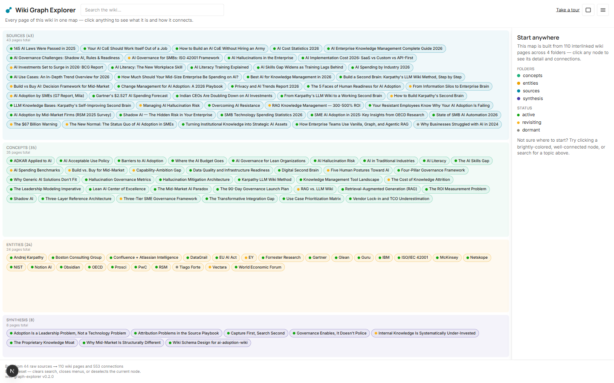
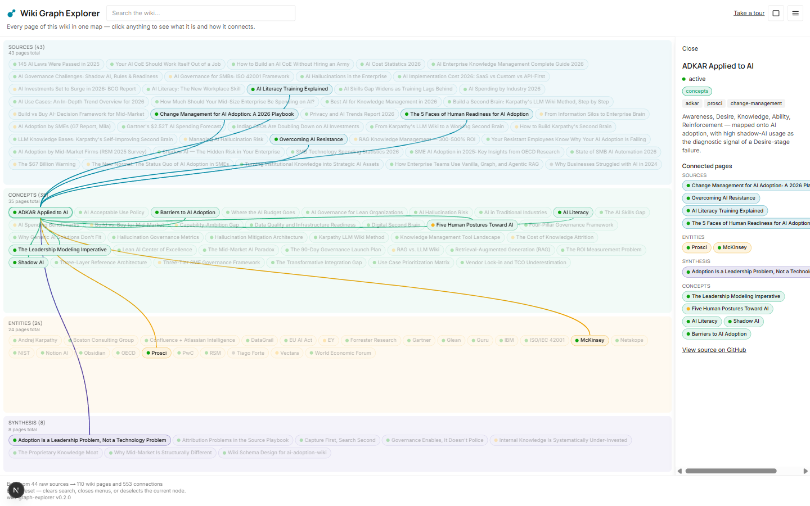
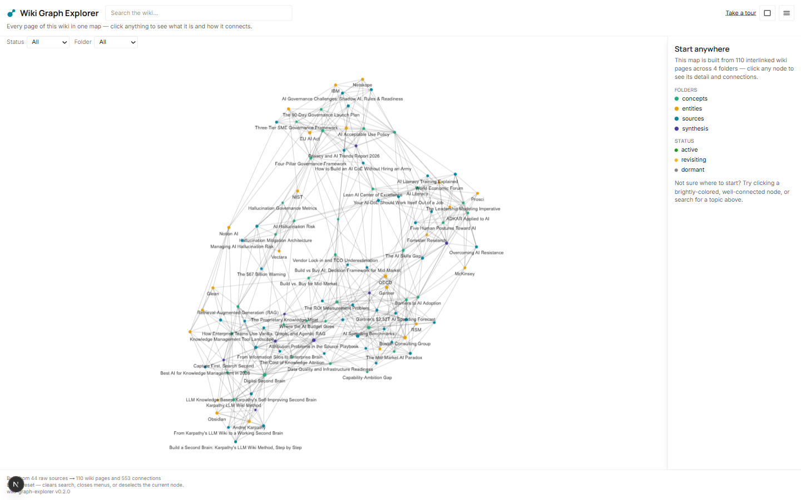
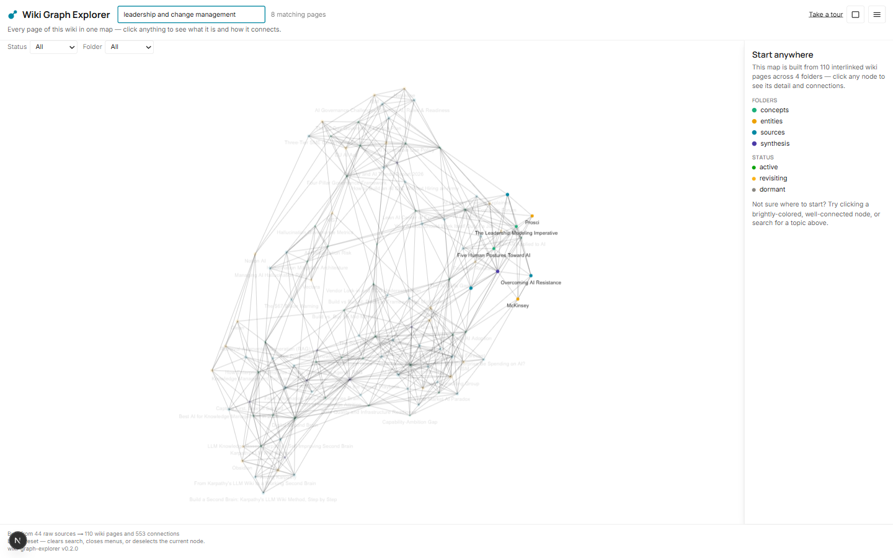
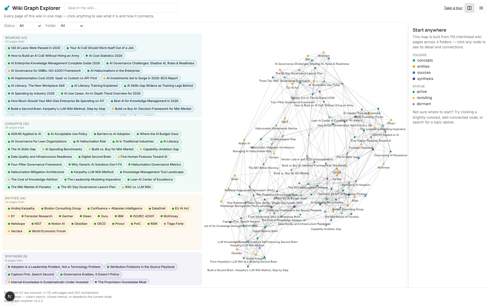

# wiki-graph-explorer

A generic, point-at-a-repo tool that turns a Karpathy-pattern wiki's backlink structure into a
clickable, explorable graph — plus a live semantic search demo over the same content. Built as a
verifiable artifact: instead of a case-study screenshot claiming "I built a personal knowledge
system," a visitor can click, zoom, search, and follow a link back to the real source Markdown.

Originated as a sub-tool of the `second-brain` / `second-brain-site` project (see
`plans/PHASE-2-wiki-graph-explorer.md` in that repo for the original scoping session); promoted
to its own repo to be developed and versioned independently.

**Status:** MVP complete — all planned epics shipped. See `docs/implementation-plan/` for the
full requirements/epic history.

## Features

- **Two graph layout modes**, toggled instantly with no data refetch or lost view state:
  - **Swim-lane** (default) — a static board (no camera pan/zoom) grouping nodes into up to 4
    horizontal lanes by folder/taxonomy (overflow collapses into a shared "Other" lane), rendered
    as labeled pill shapes. Edges are hidden until a node is clicked, at which point animated
    curved connector lines draw from it to each related node, unconnected pills dim, and
    low-connectivity peripheral nodes reveal themselves with a dashed border.
  - **Force-directed** — a physics-based `react-force-graph-2d` canvas. Nodes are colored by
    folder/taxonomy cluster, sized by edge count relative to their cluster's best-connected peer
    (so under-connected "missing link" nodes visibly stand out), and carry a small status dot
    (active / revisiting / dormant). Clicking a node animates a ~900ms center-and-zoom.
- **Dual-pane view** — show both layout modes side by side at once, each independently
  interactive, with the last-interacted pane remembered when collapsing back to one.
- **Live semantic search** — a typed query is embedded client-side and ranked against every page's
  precomputed embedding by cosine similarity, live-filtering and dimming the graph as you type —
  not a keyword filter.
- **Status and folder filters** (force-directed mode) — dropdown filters derived from the live
  dataset dim any node that doesn't match the selected status or folder/taxonomy cluster.
- **Side panel** — clicking any node opens page detail (title, tags, status, full related-node
  list, cited sources, and description) plus a "View source on GitHub" link to the raw Markdown,
  without losing graph/view state. On narrow viewports it appears as a bottom sheet instead of a
  side column.
- **Guided tour** — a hand-curated, edge-connected walk through the public demo vault's most
  interesting pages, with captions explaining what each stop shows.
- **Keyboard-first interaction** — `Ctrl+K` or `/` jumps focus to search from anywhere on the
  page; `Esc` reliably undoes the most recent thing you did, peeling exactly one layer per press
  in order: exit the tour, then close the Options popover, then clear the search query, then
  deselect the current node.
- **Responsive down to 390px** — the graph board, header, and search input stay usable at phone
  width; the side panel becomes a bottom sheet instead of a fixed column.
- **"Why build this" explainer** — a popover on `/graph` explaining the second-brain /
  dynamic-context rationale and walking a visitor through using the filters, edge-count sizing,
  and side panel together to spot a real missing link.
- **Dark/light theme**, persisted across visits, dark by default.

## Screenshots

All screenshots below are from the public demo vault
([`ai-adoption-wiki`](https://github.com/athandapani/ai-adoption-wiki)) — the same dataset the
deployed site builds against.

**Swim-lane view (default)** — folder-lane layout with connector lines revealed on click:




**Force-directed view** — physics-based, freely explorable network:



**Live semantic search** — typing a query dims everything except the closest-matching pages:



**Dual-pane view** — both layouts side by side:



## Tech Stack

Next.js (static export) + React + TypeScript, `react-force-graph-2d` for the force-directed
canvas, Tailwind CSS, build-time embeddings via `@huggingface/transformers`
(`Xenova/all-MiniLM-L6-v2`, 384-dim) reused client-side for query embedding, Vitest for tests. No
server runtime in production — the deployed artifact is a static site (GitHub Pages).

## Getting Started

```bash
npm install
npm run dev          # http://localhost:3000
```

`/graph` fetches `public/graph-data.json` and `public/vector-index.json` client-side, so you need
to build those first (see below) before there's anything to render.

### Building the graph data

```bash
npm run build:graph -- --vault <path-to-a-Karpathy-pattern-wiki>
```

This walks every Markdown file under `<path>`, parses YAML frontmatter (`title`, `tags`, `status`)
and `## Related` / `## Referenced By` wikilinks, computes an embedding per page, and writes
`graph-data.json` + `vector-index.json`. Every run fully regenerates both files — there is no
incremental/partial update, and `--vault` has no fallback (no env var, no cached path).

**For local dev iteration against a richer, real dataset**, point `--vault` at your private
`second-brain` vault (a sibling directory, e.g. `../second-brain`) per the project's dogfooding
workflow — this output is gitignored and must never be committed or deployed. Only builds against
the dedicated public demo vault (the external [`ai-adoption-wiki`](https://github.com/athandapani/ai-adoption-wiki)
repo, checked out as a sibling directory in CI) are ever deployed; the CI/CD pipeline hardcodes
that path with no override.

### Quality gates

```bash
npm test          # vitest run
npm run lint       # eslint
npm run typecheck  # tsc --noEmit
npm run build      # next build (static export)
```

## Deployment

GitHub Actions builds against the dedicated public vault only, runs a vault-safety check
(`npm run check:vault-safety`) that scans tracked files for any hardcoded private-vault path
reference, and publishes the static export to GitHub Pages on push to `master`.

## Documentation

- `docs/product-vision-planning/product-vision.md` — product vision & MVP scope
- `docs/architecture.md` / `docs/design-notes.md` — as-built architecture and design decisions
- `docs/requirements/` — the TOR requirements baseline (Gherkin feature files)
- `docs/implementation-plan/` — epic history and per-epic completion handoffs
